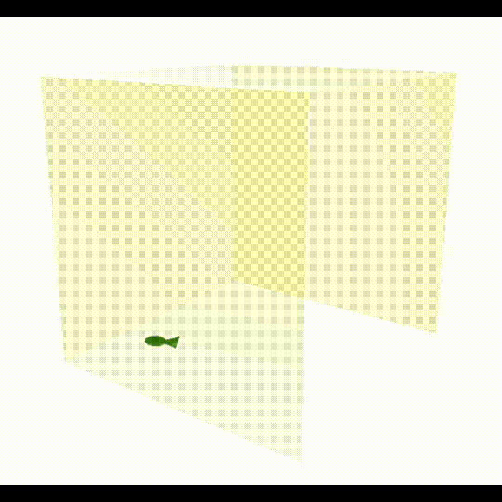

# FishTank.jl

[](https://github.com/akjake616/FishTank.jl/actions/workflows/CI.yml)

`FishTank.jl` creates an e-fish for you in case you feel lonely when you are coding :fish:. The game is visualized using [`PlotlyJS.jl`](https://github.com/JuliaPlots/PlotlyJS.jl) and [`PlotlyGeometries.jl`](https://github.com/akjake616/PlotlyGeometries.jl).

<p align="center">
  
</p>

## Features

- **Customized Fish Tank**: Set up your unique fish tank environment :boom:
- **Interactive Fish Feeding**: Add fish feed and wait for your fish to eat them up :diamonds:
- **Realistic Fish Behavior**: Fish can sleep occasionally, mimicking natural behavior :zzz:
- **Decorate with Water Plants**: Enhance the tank with water plants for a more vibrant look :seedling:
- **Random Landscape**: Landscape created with a random Gaussian surface (using [`FFTW.jl`](https://github.com/JuliaMath/FFTW.jl) under GPL license :exclamation:)

## Installation

To install `FishTank.jl`, use the following command in the Julia REPL:

```julia
using Pkg
Pkg.add("FishTank")
```

## Usage

In order to start a fish tank, you simply need to use the package and call the `init()` function.

```julia
using FishTank
init() # creates a random colored fish by default.
```

To feed the fish with, for example, six grains, call the following:

```julia 
feed(6) # add 6 grains to the fish tank, if the input is not specified, 10 grains are added
```

To decorate the fish tank with waterweed:
```julia 
plant() # randomly plant one waterweed bunble
```

You can also set the az/el view angle by
```julia 
look(0, 10) # az = 0 deg, el = 10 deg
```
or even do some animations:

```julia
@async for n in 1:360
    look(n, 0)
    sleep(0.1)
end
```

Enjoy! :angel:

## APIs

The following APIs are used to interact with the fish.
___

```julia
init(color::String)
```
Initialization of the fish and tank. The fish is specified with the color=`color`. If `color` is not specified, the color of the fish is set to be random. Currently only one fish tank can be initialized per process.

___

```julia
pause()
```
Pause simulation. If you want to rotate the tank (for a different view), one should pause the simulation first. I have no better solution for this (rotating the plot and continuing the simulation at the same time), so feel free to contribute if you know how to solve this issue :kissing_heart:
___

```julia
go()
```
Continue simulation.
___

```julia
mute()
```
Turn off sound effects. The default is on.
___

```julia
unmute()
```
Turn on sound effects.
___

```julia
feed(n::Int=10)
```
Add `n` grains (add 10 if `n` not specified).
___

```julia
check()
```
Check the number of grains.

___

```julia
plant()
```
Plant waterweed.

___

```julia
replot()
```
Replot the fish tank window (if it is accidentally closed).

___

```julia
look(az::Real, el::Real)
```
Set the [az/el view angle](https://matplotlib.org/stable/api/toolkits/mplot3d/view_angles.html).  A word on the view: currently in order to solve memory usage issues, I have to purge the plot every period of time, and this resets the view angle if you rotates the plot by `pause() -> iteractive rtation -> go()`. It is better to set the default view angle by this function. Think of `pause()` and `go()` as some debug functionalities please :satisfied:

___


